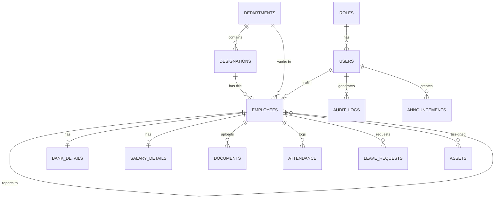

# Database Schema - Employee Management System (EMS)

This document outlines the database schema for the Employee Management System, designed for MySQL 8.0. The schema is normalized to reduce redundancy and ensure data integrity.

## Entity Relationship Diagram (ERD)

---

## 1. Core Administration Tables

### `roles`
Stores the different user roles in the system (Super Admin, HR Admin, Manager, Employee).
| Column Name | Data Type | Constraints | Description |
| :--- | :--- | :--- | :--- |
| `id` | INT | PRIMARY KEY, AUTO_INCREMENT | Unique identifier for role |
| `name` | VARCHAR(50) | NOT NULL, UNIQUE | Role name (e.g., 'HR Admin') |
| `description` | VARCHAR(255) | NULL | Brief description of role permissions |

### `users`
Manages authentication credentials and role assignments.
| Column Name | Data Type | Constraints | Description |
| :--- | :--- | :--- | :--- |
| `id` | INT | PRIMARY KEY, AUTO_INCREMENT | Unique identifier for user |
| `email` | VARCHAR(100) | NOT NULL, UNIQUE | Login email (usually company email) |
| `password_hash` | VARCHAR(255) | NOT NULL | Encrypted password |
| `role_id` | INT | FOREIGN KEY (`roles.id`) | Links user to a specific role |
| `is_active` | BOOLEAN | DEFAULT TRUE | Indicates if the user account is active |
| `last_login` | DATETIME | NULL | Timestamp of last successful login |
| `created_at` | TIMESTAMP | DEFAULT CURRENT_TIMESTAMP | Record creation time |

### `audit_logs`
Tracks all major actions for security and compliance.
| Column Name | Data Type | Constraints | Description |
| :--- | :--- | :--- | :--- |
| `id` | BIGINT | PRIMARY KEY, AUTO_INCREMENT | Unique identifier for log |
| `user_id` | INT | FOREIGN KEY (`users.id`) | The user performing the action |
| `action` | VARCHAR(255) | NOT NULL | Description of action (e.g., 'Login', 'Update Profile') |
| `ip_address` | VARCHAR(45) | NULL | IP address of the user |
| `created_at` | TIMESTAMP | DEFAULT CURRENT_TIMESTAMP | Timestamp of action |

---

## 2. Organization Tables

### `departments`
Stores company departments.
| Column Name | Data Type | Constraints | Description |
| :--- | :--- | :--- | :--- |
| `id` | INT | PRIMARY KEY, AUTO_INCREMENT | Unique identifier for department |
| `department_code` | VARCHAR(50) | NOT NULL, UNIQUE | Auto-generated ID |
| `name` | VARCHAR(100) | NOT NULL, UNIQUE | Department name (e.g., 'Engineering') |
| `description` | TEXT | NULL | Details about the department |
| `department_head_id`| INT | FOREIGN KEY (`employees.id`) | Head of department |
| `status` | ENUM('Active', 'Inactive') | DEFAULT 'Active' | Current status |
| `created_at` | TIMESTAMP | DEFAULT CURRENT_TIMESTAMP | Record creation time |

### `designations`
Stores job titles linked to specific departments.
| Column Name | Data Type | Constraints | Description |
| :--- | :--- | :--- | :--- |
| `id` | INT | PRIMARY KEY, AUTO_INCREMENT | Unique identifier for designation |
| `designation_code` | VARCHAR(50) | NOT NULL, UNIQUE | Auto-generated ID |
| `department_id` | INT | FOREIGN KEY (`departments.id`) | Linked department |
| `title` | VARCHAR(100) | NOT NULL | Job title (e.g., 'Senior Developer') |
| `description` | TEXT | NULL | Details about the role |
| `status` | ENUM('Active', 'Inactive') | DEFAULT 'Active' | Current status |
| `created_at` | TIMESTAMP | DEFAULT CURRENT_TIMESTAMP | Record creation time |

---

## 3. Employee Management Tables

### `employees`
Core table containing employee personal and official information.
| Column Name | Data Type | Constraints | Description |
| :--- | :--- | :--- | :--- |
| `id` | INT | PRIMARY KEY, AUTO_INCREMENT | Unique identifier |
| `user_id` | INT | FOREIGN KEY (`users.id`), UNIQUE | Links to authentication record |
| `employee_code` | VARCHAR(50) | NOT NULL, UNIQUE | Auto-generated ID (e.g., 'EMP-1001') |
| `first_name` | VARCHAR(50) | NOT NULL | Employee's first name |
| `last_name` | VARCHAR(50) | NOT NULL | Employee's last name |
| `gender` | ENUM('Male', 'Female', 'Other') | NOT NULL | Gender |
| `date_of_birth` | DATE | NOT NULL | Birth date |
| `nationality` | VARCHAR(50) | NULL | Employee nationality |
| `blood_group` | VARCHAR(10) | NULL | Blood group |
| `marital_status`| VARCHAR(20) | NULL | Marital status |
| `personal_email`| VARCHAR(100) | NOT NULL, UNIQUE | Personal email address |
| `mobile_number` | VARCHAR(20) | NOT NULL, UNIQUE | Primary mobile number |
| `alternate_mobile`| VARCHAR(20) | NULL | Secondary mobile number |
| `emergency_contact` | VARCHAR(20) | NOT NULL | Emergency contact number |
| `address` | TEXT | NOT NULL | Permanent/Current address |
| `department_id` | INT | FOREIGN KEY (`departments.id`) | Linked department |
| `designation_id`| INT | FOREIGN KEY (`designations.id`)| Linked designation |
| `manager_id` | INT | FOREIGN KEY (`employees.id`) | Reporting Manager |
| `branch` | VARCHAR(100) | NULL | Work branch |
| `location` | VARCHAR(100) | NULL | Work location |
| `employment_type`| ENUM('Full-Time', 'Part-Time', 'Contract') | NOT NULL | Type of employment |
| `joining_date` | DATE | NOT NULL | Date of joining |
| `probation_period`| INT | NULL | Probation duration (in months) |
| `status` | ENUM('Active', 'Inactive', 'Terminated')| DEFAULT 'Active' | Current employment status |
| `created_at` | TIMESTAMP | DEFAULT CURRENT_TIMESTAMP | Record creation time |
| `updated_at` | TIMESTAMP | ON UPDATE CURRENT_TIMESTAMP | Last modification time |

### `bank_details`
Stores financial information for payroll.
| Column Name | Data Type | Constraints | Description |
| :--- | :--- | :--- | :--- |
| `id` | INT | PRIMARY KEY, AUTO_INCREMENT | Unique identifier |
| `employee_id` | INT | FOREIGN KEY (`employees.id`), UNIQUE | Associated employee |
| `bank_name` | VARCHAR(100) | NOT NULL | Name of the bank |
| `account_number`| VARCHAR(50) | NOT NULL | Bank account number |
| `ifsc_code` | VARCHAR(20) | NOT NULL | IFSC/Routing code |
| `branch_name` | VARCHAR(100) | NULL | Bank branch name |
| `account_holder`| VARCHAR(100) | NOT NULL | Name on the account |

### `salary_details`
Stores salary structures.
| Column Name | Data Type | Constraints | Description |
| :--- | :--- | :--- | :--- |
| `id` | INT | PRIMARY KEY, AUTO_INCREMENT | Unique identifier |
| `employee_id` | INT | FOREIGN KEY (`employees.id`), UNIQUE | Associated employee |
| `basic_salary` | DECIMAL(10,2) | NOT NULL | Basic pay component |
| `hra` | DECIMAL(10,2) | DEFAULT 0.00 | House Rent Allowance |
| `allowances` | DECIMAL(10,2) | DEFAULT 0.00 | Other allowances |
| `bonus` | DECIMAL(10,2) | DEFAULT 0.00 | Performance/Annual bonus |
| `pf_number` | VARCHAR(50) | NULL | Provident Fund account number |
| `esi_number` | VARCHAR(50) | NULL | Employee State Insurance number |
| `professional_tax`| DECIMAL(10,2)| DEFAULT 0.00 | Professional tax deduction |

### `documents`
Stores references to uploaded employee documents.
| Column Name | Data Type | Constraints | Description |
| :--- | :--- | :--- | :--- |
| `id` | INT | PRIMARY KEY, AUTO_INCREMENT | Unique identifier |
| `employee_id` | INT | FOREIGN KEY (`employees.id`) | Uploader employee |
| `document_type` | VARCHAR(50) | NOT NULL | Type (Aadhaar, PAN, Resume, etc.) |
| `file_path` | VARCHAR(255) | NOT NULL | File location on server/cloud |
| `uploaded_at` | TIMESTAMP | DEFAULT CURRENT_TIMESTAMP | Time of upload |

---

## 4. Operation Tables

### `attendance`
Tracks daily employee clock-ins and clock-outs.
| Column Name | Data Type | Constraints | Description |
| :--- | :--- | :--- | :--- |
| `id` | BIGINT | PRIMARY KEY, AUTO_INCREMENT | Unique identifier |
| `employee_id` | INT | FOREIGN KEY (`employees.id`) | Associated employee |
| `date` | DATE | NOT NULL | Date of attendance |
| `check_in` | DATETIME | NULL | Timestamp of check-in |
| `location` | VARCHAR(255) | NULL | Location string/coordinates |
| `device_info` | VARCHAR(255) | NULL | Browser/OS/Device info |
| `check_out` | DATETIME | NULL | Timestamp of check-out |
| `status` | ENUM('Present', 'Absent', 'Half Day', 'Leave') | NOT NULL | Daily attendance status |
| `total_hours` | DECIMAL(5,2) | DEFAULT 0.00 | Calculated total working hours |

### `leave_requests`
Manages employee leave applications.
| Column Name | Data Type | Constraints | Description |
| :--- | :--- | :--- | :--- |
| `id` | INT | PRIMARY KEY, AUTO_INCREMENT | Unique identifier |
| `employee_id` | INT | FOREIGN KEY (`employees.id`) | Applicant |
| `leave_type` | ENUM('Sick', 'Casual', 'Earned', 'Maternity') | NOT NULL | Type of leave |
| `start_date` | DATE | NOT NULL | Start date of leave |
| `end_date` | DATE | NOT NULL | End date of leave |
| `half_day` | BOOLEAN | DEFAULT FALSE | Is it a half day leave |
| `reason` | TEXT | NOT NULL | Applicant's reason |
| `document_path` | VARCHAR(255) | NULL | Uploaded document path |
| `status` | ENUM('Pending', 'Approved', 'Rejected', 'Cancelled')| DEFAULT 'Pending' | Status of the request |
| `approved_by` | INT | FOREIGN KEY (`employees.id`) | Manager/HR who took action |
| `action_date` | DATETIME | NULL | When the decision was made |
| `created_at` | TIMESTAMP | DEFAULT CURRENT_TIMESTAMP | Application time |

### `announcements`
Stores company-wide announcements.
| Column Name | Data Type | Constraints | Description |
| :--- | :--- | :--- | :--- |
| `id` | INT | PRIMARY KEY, AUTO_INCREMENT | Unique identifier |
| `title` | VARCHAR(255) | NOT NULL | Announcement title |
| `content` | TEXT | NOT NULL | Announcement body |
| `created_by` | INT | FOREIGN KEY (`users.id`) | User (HR/Admin) who created it|
| `created_at` | TIMESTAMP | DEFAULT CURRENT_TIMESTAMP | Record creation time |

### `assets`
Tracks company assets assigned to employees.
| Column Name | Data Type | Constraints | Description |
| :--- | :--- | :--- | :--- |
| `id` | INT | PRIMARY KEY, AUTO_INCREMENT | Unique identifier |
| `name` | VARCHAR(100) | NOT NULL | Asset name (e.g., 'MacBook Pro') |
| `description` | TEXT | NULL | Asset specifics/serial number |
| `assigned_to` | INT | FOREIGN KEY (`employees.id`) | Employee currently holding asset|
| `assigned_date` | DATE | NULL | Date given to employee |
| `return_date` | DATE | NULL | Date to be returned / returned |
| `status` | ENUM('Available', 'Assigned', 'Under Maintenance', 'Lost') | DEFAULT 'Available' | Asset condition |

---

## Best Practices & Indexing Strategy
1. **Primary & Foreign Keys**: Used extensively to maintain referential integrity.
2. **Prepared Statements**: All database operations from the PHP backend must use PDO prepared statements.
3. **Indexing**: 
   - Ensure indexes are created on frequently searched columns like `email`, `employee_code`, and `mobile_number`.
   - Add indexes on Foreign Keys (`department_id`, `designation_id`, `user_id`, `employee_id`) for faster joins.
4. **Dates & Timestamps**: Timestamps handle created/updated automations. Dates are explicitly kept for specific day markers (DOB, Joining date, etc.).
5. **Enums**: Strictly restricting textual state values (Status, Employment Type, etc.) to minimize corrupted/inconsistent data entries.
